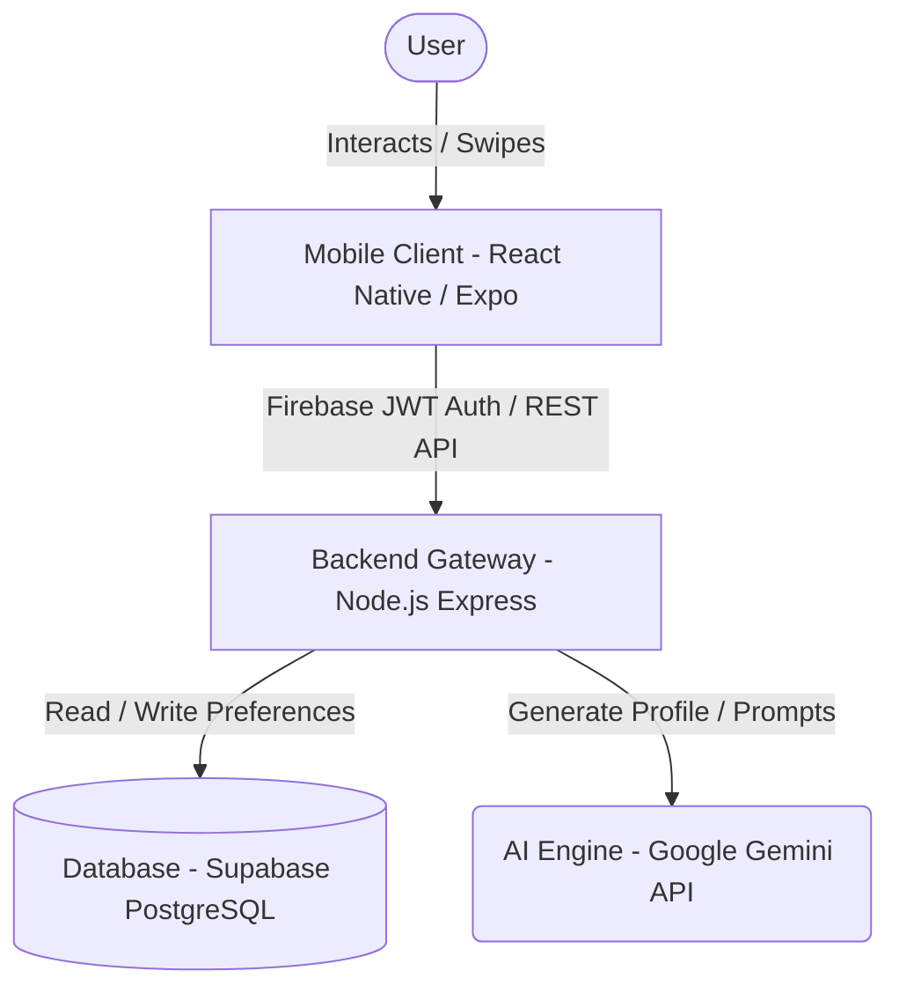
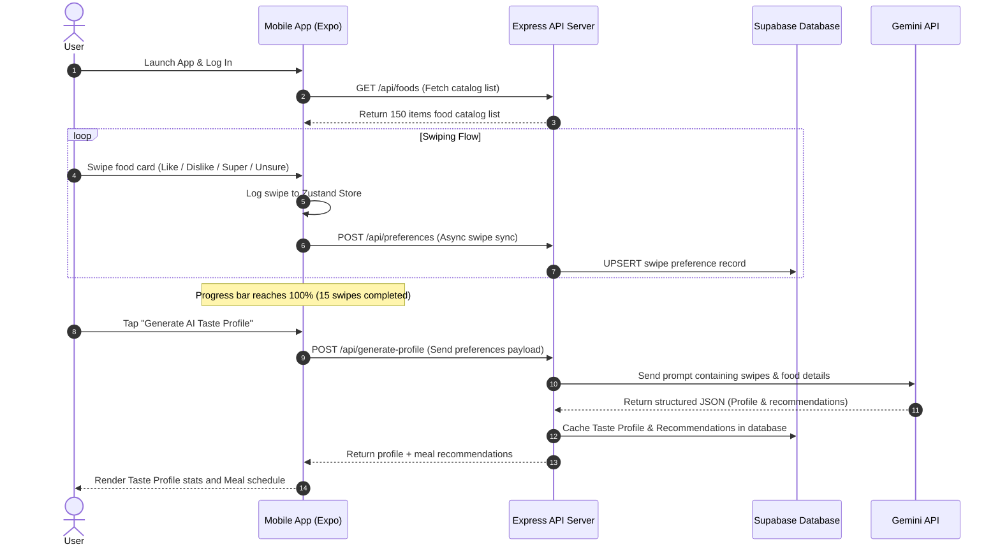

# System Architecture & Design - CalorAI

This document details the system architecture, component communication structures, and database flows of the CalorAI application.

---

## 🏗️ System Design Overview

CalorAI uses a client-server architecture. The mobile application communicates with our Node.js Express server to log swiping preferences and retrieve AI recommendations.

---

## 📡 Core System Flow Diagram

The following sequence diagram outlines the process of card swiping, taste profile compilation, database caching, and AI meal recommendations generation:

---

## 🏛️ Component Specifications

### 1. Mobile Client (React Native + Expo)
* **View Layer**: Implemented using **Expo Router** slots. View styling is compiled using **NativeWind** (Tailwind CSS for React Native).
* **Gesture Layer**: Handled by **React Native Gesture Handler**'s `PanGestureHandler` and animated via **React Native Reanimated (v3)** to maintain 60 FPS transitions.
* **State Store**: Managed by **Zustand**. Stores local swipe selections, undo history stacks, and active user details.
* **API Client**: Implemented with **Axios** (linking client endpoints) and **React Query** (managing cached state, loading variables, and offline fallbacks).

### 2. Backend Gateway (Node.js + Express)
* **Router**: Standard routing modules using TypeScript compiles.
* **Auth Middleware**: Verifies incoming Firebase ID Tokens using the `firebase-admin` verification SDK.
* **Error Boundary**: Catches controller exceptions and returns standard JSON error responses.

### 3. Database Layer (Supabase PostgreSQL)
* **Users Table**: Syncs Firebase Auth accounts.
* **Foods Table**: Stores the 150 food items catalog.
* **Preferences Table**: Stores user swipe selections (Like, Dislike, Super Like, Unsure), with a unique constraint on `(user_id, food_id)` to prevent duplicates.
* **Taste Profiles Table**: Caches taste highlights, lifestyles, and cuisines.
* **Recommendations Table**: Caches meal plans and weekly schedules.

### 4. AI Recommendation Engine (Google Gemini)
* Interfaces with the `gemini-1.5-flash` model.
* Formats user swipe logs into a nutritional structured prompt.
* Instructs Gemini to return a structured JSON response, which is parsed and cached.
